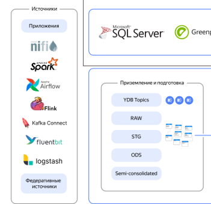

# Ввод данных



Для аналитических систем важна способность принимать большие объемы входящих данных. В {{ydb-short-name}} нет выделенных мастер-узлов, поставка данных происходит параллально на все узлы базы данных, линейно масштабируясь с ростом их количества, вплоть до сотен гигабайт в секунду (зависит от используемого оборудования).

Поставку данных в {{ydb-short-name}} можно организовать с использованием следующих инструментов:

- [{#T}](#topic).
- [{#T}](#fluentbit_logstash).
- [{#T}](#bulk_upsert).
- [{#T}](#jdbc).

## Топики {#topic}

[Топики](../../concepts/topic.md) — сущность для хранения неструктурированных сообщений, предназначенная для их доставки множеству подписчиков, позволяют вводить в {{ydb-short-name}} произвольные объемы данных. За счет поддержки [Kafka API](../../reference/kafka-api/index.md) для поставки данных можно использовать любые системы, совместимые с Apache Kafka такие как Apache Flink, Apache Spark, Kafka Connect и другие.

Запись может производиться сообщениями любых размеров даже с высоким RPS записи и небольшими объемами записей.

### Транзакционная передача данных {#topic_transactions}

Топики обеспечивают максимально возможные гарантии при передаче данных. Гарантируется поддержка:

- Порядка передаваемых данных
- Возможность [прозрачно масштабироваться](../../concepts/topic#autopartitioning) при изменении объема входящих данных
- Гарантии транзакционной передачи данных с помощью [встроенного механизма транзакций](../../concepts/topic.md#topic-transactions) между топиками и таблицами.

Пример транзакционной передачи данных:

```cpp
tx = BeginTransaction();
data = ReadFromTopic(tx);
results = ProcessData(data);
InsertIntoTable(results);
WriteToTopic(results);
CommitTransaction(tx);
```

### Трансфер { #transfer }

С помощью компонента [!!!Трансфер](.) можно выполнять автоматическую поставку данных из Топиков в таблицы. Поставка выполняется в гарантиями `at least once` с использованием всех доступных мощностей базы данных.

Пример запроса на перенос данных:

```sql
CREATE TRANSFER '/Root/transfer1'
    FROM '/Root/topic'
    TO '/Root/table'
    USING ($x) -> {
        RETURN Dict(
        "ts": $x["ts"],
        "value": $x["value"]+1) ; }
    WITH (
        ENDPOINT = "...",
        DATABASE = "..." );
```

## Плагины для fluentbit/logstash {#fluentbit_logstash}

fluentbit/logstash — популярные системы для записи данных в системы хранения. {{ydb-short-name}} предоставляет специализированные плагины к этим система для прямой записи данных в таблицы. Использование fluentbit/logstash позволяет оптимизировать объем ресурсов, необходимый для ввода данных, но требует записи большими блоками.

## BulkUpsert {#bulk_upsert}

[BulkUpsert](../../recipes/ydb-sdk/bulk-upsert.md) это механизм {{ydb-short-name}} для ввода больших объемов данных напрямую в таблицы. Такой механизм требует значительно меньшее количество ресурсов со стороны сервера, позволяя писать данные на максимально возможной скорости, но не обеспечивает гарантий транзакционности.

Примерами данных, которые следует передавать с помощью этого механизма являются:

- журналы работы приложения
- метрики оборудования
- другие виды данных, не требующих транзакционных гарантий

## JDBC-драйвера {#jdbc}

С помощью JDBC-драйверов можно записывать данные из различных источников, например из
Apache Spark, Apache NiFi, любых других приложений, поддерживающих JDBC.

